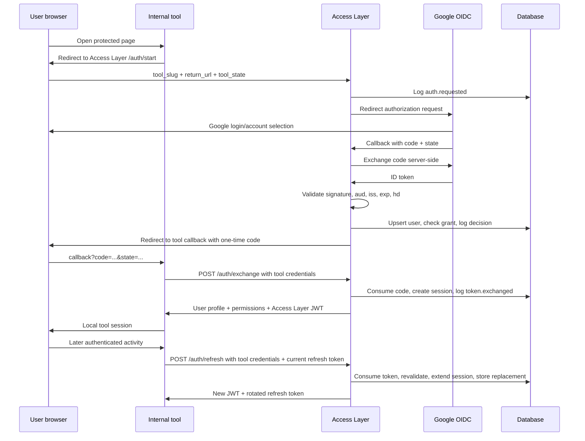

# ARCHITECTURE_OVERVIEW.md

## Trust boundaries

- Browser is not trusted for identity, permissions or token integrity.
- Tool frontend is not trusted to hold tool secrets.
- Tool backend is trusted only after client authentication.
- Google ID token is trusted only after server-side validation.
- Access Layer JWT is trusted only after signature, issuer, audience and expiration checks.
